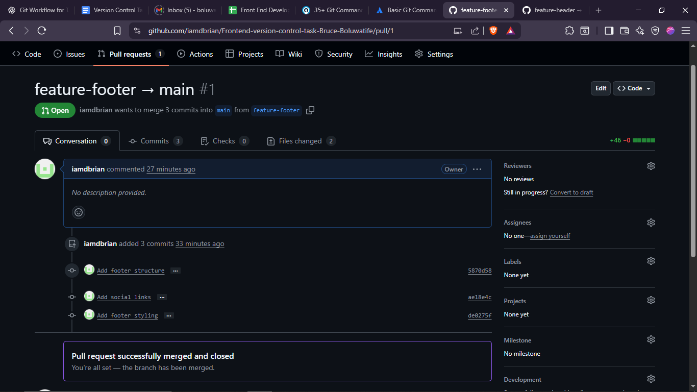
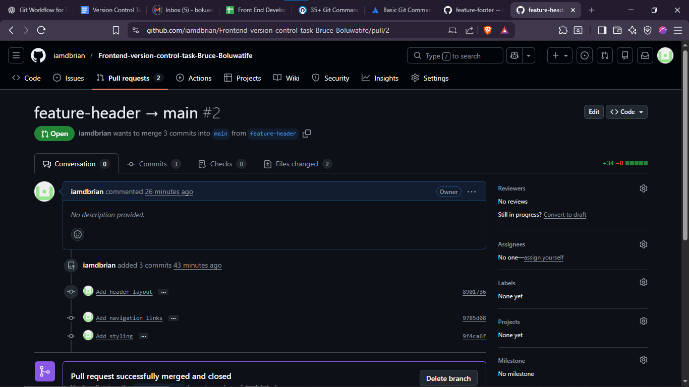

📌 Purpose

This repository demonstrates practical understanding of Git version control workflows, feature branching, pull request collaboration, commit conventions, and safe reversion strategies in a frontend project.

index.html
css/style.css

🌿 Branches

| Branch              | Purpose                            |
| ------------------- | ---------------------------------- |
| main                | Production-ready code              |
| feature-header      | Header & navigation implementation |
| feature-site-footer | Footer implementation              |

🔄 Workflow Implemented

Feature branching strategy

Conventional Commit messages

Pull Requests for code review

Simulated review feedback

Merge best practices

Safe commit reversion using git revert

Branch renaming and cleanup

PR creation

Code review comments

Commit history

Revert commit

Branch rename

Frequently Used Git Commands
git init
git checkout -b branch-name
git add .
git commit -m "type(scope): message"
git push origin branch-name
git pull origin main
git revert <commit-hash>
git branch -m old-name new-name
git fetch origin

📚 Lessons Learned

Importance of small, meaningful commits

Clean branching structure improves collaboration

Conventional Commits enhance readability

git revert is safer than git reset for shared branches

Pull Requests improve code quality and documentation

7️⃣ BEST PRACTICES DEMONSTRATED

✅ Feature branch workflow
✅ Atomic commits
✅ Conventional Commits standard
✅ PR-based merging
✅ Safe reversion strategy
✅ Clean repository structure
✅ Clear documentation
✅ Professional GitHub presentation